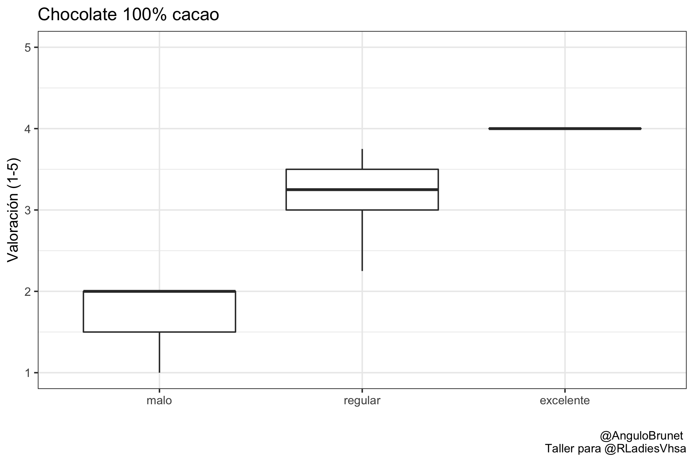
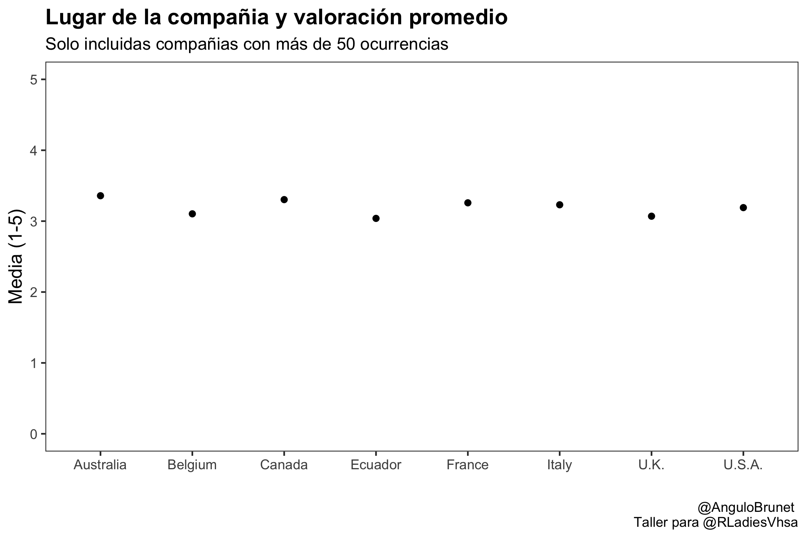

# Gráficos para investigación

#### Ariadna Angulo-Brunet


Este texto forma parte del taller desarrollado en julio de 2022 para [Rladies Villahermosa](https://twitter.com/RLadiesVhsa). Puedes encontrar los Scripts completos en [esta carpeta](/Scripts) y un video en el canal de Facebook de Rladies Villahermosa [video](https://fb.watch/jhdnYhZnz0/). El objetivo principal es aprender a gráficos básicos y adaptarlos a diferentes formatos que pueden pedir las revistas. Para ello, además de aprender a utilizar los elementos básicos de ggplot, también vamos a aprender a personalizar _themes_ 

Vamos a necesitar los siguientes paquetes:

```R
library(tidyverse)
library(jtools)
```
Durante este mini tutorial vamos a realizar un gráfico de barras, un gráfico de barras apiladas, un gráfico de cajas y bigotes (boxplot), un gráfico con la media y sus intervalos así como un scatterplot. La intención no es ver todo el tipo de gráficos posibles en R, sino aprender a personalizarlos de manera que puedan ser publicables en una revista científica. 


Para todo este ejemplo vamos a trabajar con datos del proyecto tidyverse, concretamente con los datos de (https://github.com/rfordatascience/tidytuesday/blob/master/data/2022/2022-01-18/readme.md). 

Que pueden abrirse de la siguiente manera: 
```
chocolate <- readr::read_csv('https://raw.githubusercontent.com/rfordatascience/tidytuesday/master/data/2022/2022-01-18/chocolate.csv')

```

Así pues el conjunto de datos con el que trabajaremos se llama `chocolate`. 

## 1. Gráfico de barras

En primer lugar haremos un gráfico de barras básico. Intuitivamente parece que tengamos que usar `geom_bar()` pero no es así. Utilizaremos `geom_col()`. 

Para facilitar la visualización de datos en este primer momento, lo que haremos es filtrar la base de datos, para que solo tengamos datos de los tipos de chocolate un un porcentaje de cacao del 100%: 

```
chocolate %>% 
  filter(cocoa_percent == "100%")
```

Además, vamos a hacer un recuento según donde este localizada la compañía que lo fabrica añadiendo un `group_by()` y un `count()`

```
chocolate %>% 
  filter(cocoa_percent == "100%") %>% 
  group_by(company_location) %>% 
  count()
```

Finalmente, para realizar el gráfico haremos servir la función `ggplot`. Es necesario especificar el `aes()`. El aes tiene que tener especificado que elementos queremos poner. En este caso, en el eje de las x queremos poner la `company_location` y en el eje de las y el recuento (que se llama `n`):

```
chocolate %>% 
  filter(cocoa_percent == "100%") %>% 
  group_by(company_location) %>% 
  count() %>% 
  ggplot(aes(x = company_location, y = n)) +
  geom_col()
  
```


Un segundo paso que podemos hacer para mejorar la visualización es cambiar el orden de las barras de manera que queden de mayor a menor frecuencia. Para ello, en el `aes`cambiamos `reorder(company_location, -n)` 

```
chocolate %>% 
  filter(cocoa_percent == "100%") %>% 
  group_by(company_location) %>% 
  count() %>% 
  ggplot(aes(x = reorder(company_location, -n), y = n)) +
  geom_col()
```


En un siguiente paso vamos a añadir títulos: 

```
chocolate %>% 
  filter(cocoa_percent == "100%") %>% 
  group_by(company_location) %>% 
  count() %>% 
  ggplot(aes(x = reorder(company_location, -n), y = n)) +
  geom_col() +
  labs(title = "Chocolate 100% cacao", 
       subtitulo = "Número de chocolates según localización de la compañia", 
       x = "Lugar de la compañia", 
       y = "Total", 
       caption = "@AnguloBrunet \n Taller para @RLadiesVhsa")
```


Ahora que ya va tomando forma, personalizaremos el fondo con temas ya predefinidos. Uno de mis favoritos es `theme_bw`aunque existen otras opciones (https://ggplot2.tidyverse.org/reference/ggtheme.html)

```
chocolate %>% 
  filter(cocoa_percent == "100%") %>% 
  group_by(company_location) %>% 
  count() %>% 
  ggplot(aes(x = reorder(company_location, -n), y = n)) +
  geom_col() +
  labs(title = "Chocolate 100% cacao", 
       subtitulo = "Número de chocolates según localización de la compañia", 
       x = "Lugar de la compañia", 
       y = "Total", 
       caption = "@AnguloBrunet \n Taller para @RLadiesVhsa") +
  theme_bw()
```


Vamos a intentarlo con otro `theme_light`

```
chocolate %>% 
  filter(cocoa_percent == "100%") %>% 
  group_by(company_location) %>% 
  count() %>% 
  ggplot(aes(x = reorder(company_location, -n), y = n)) +
  geom_col() +
  labs(title = "Chocolate 100% cacao", 
       subtitulo = "Número de chocolates según localización de la compañia", 
       x = "Lugar de la compañia", 
       y = "Total", 
       caption = "@AnguloBrunet \n Taller para @RLadiesVhsa") +
  theme_light()
```


Además de estos predefinidos también existen otros. Este es el ejemplo de `theme_apa`que está predefinido al formato recomendado por APA (psicologia) y que depende del paquete `jtools`:

```

chocolate %>% 
  filter(cocoa_percent == "100%") %>% 
  group_by(company_location) %>% 
  count() %>% 
  ggplot(aes(x = reorder(company_location, -n), y = n)) +
  geom_col() +
  labs(title = "Chocolate 100% cacao", 
       subtitulo = "Número de chocolates según localización de la compañia", 
       x = "Lugar de la compañia", 
       y = "Total", 
       caption = "@AnguloBrunet \n Taller para @RLadiesVhsa") +
  theme_apa()
```


## 2. Barras apiladas
En segundo lugar, vamos a realizar un gráfico de barras apiladas. Para ello, seguiremos trabajar con el chocolate 100% puro. En primer lugar, vamos a crear una nueva variable, llamada `valoracion` en función de si el `rating`es malo, regular o excelente. Lo haremos con la función `mutate`.y la función `case_when`. 

```
chocolate %>% 
  filter(cocoa_percent == "100%") %>% 
  mutate(valoracion = case_when(
    rating <= 2 ~ "malo", 
    rating <= 3.99 ~ "regular",
    rating >=4 ~ "excelente")) 
```

Una vez tenemos creada la variable, vamos a hacer un recuento de casos teniendo en cuenta la localización de la compañía `company_location` y la valoración `valoración`. 

```
chocolate %>% 
  filter(cocoa_percent == "100%") %>% 
  mutate(valoracion = case_when(
    rating <= 2 ~ "malo", 
    rating <= 3.99 ~ "regular",
    rating >=4 ~ "excelente")) %>% 
  group_by(company_location, valoracion) %>% 
  count() 
```

De forma similar a cuando hacíamos barras no apiladas, utilizaremos la función `ggplot` pero en este caso añadiremos dentro una nueva funcionalidad: `fill`. Esto nos permitirá colorear según el grupo (en este caso valoración)

```
chocolate %>% 
  filter(cocoa_percent == "100%") %>% 
  mutate(valoracion = case_when(
    rating <= 2 ~ "malo", 
    rating <= 3.99 ~ "regular",
    rating >=4 ~ "excelente")) %>% 
  group_by(company_location, valoracion) %>% 
  count() %>% 
  ggplot(aes(x = company_location, y = n, fill = valoracion)) +
  geom_col()
```


Igual que en el caso anterior, añadiremos los títulos necesarios

```

chocolate %>% 
  filter(cocoa_percent == "100%") %>% 
  mutate(valoracion = case_when(
    rating <= 2 ~ "malo", 
    rating <= 3.99 ~ "regular",
    rating >=4 ~ "excelente")) %>% 
  group_by(company_location, valoracion) %>% 
  count() %>% 
  ggplot(aes(x =  reorder(company_location, -n), y = n, fill = valoracion)) +
  geom_col() +
  labs(title = "Chocolate 100% cacao", 
       subtitulo = "Número de chocolates según localización de la compañia", 
       x = "Lugar de la compañia", 
       y = "Total", 
       fill = "Valoración",
       caption = "@AnguloBrunet \n Taller para @RLadiesVhsa")
```


Además cambiaremos el color de las barras de manera que sean de color gris. `scale_fill_manual(values = c("grey31", "grey70")) ` :

```

chocolate %>% 
  filter(cocoa_percent == "100%") %>% 
  mutate(valoracion = case_when(
    rating <= 2 ~ "malo", 
    rating <= 3.99 ~ "regular",
    rating >=4 ~ "excelente")) %>% 
  group_by(company_location, valoracion) %>% 
  count() %>% 
  ggplot(aes(x =  reorder(company_location, -n), y = n, fill = valoracion)) +
  geom_col() +
  labs(title = "Chocolate 100% cacao", 
       subtitulo = "Número de chocolates según localización de la compañia", 
       x = "Lugar de la compañia", 
       y = "Total", 
       fill = "Valoración",
       caption = "@AnguloBrunet \n Taller para @RLadiesVhsa") +
  scale_fill_manual(values = c("grey31", "grey70")) + 
  theme_bw()
```


Si queremos ver el porcentaje o las proporciones, será necesario calcularlo anteriormente añadiendo 
```
  summarise(n = n()) %>%
  mutate(freq = n / sum(n)) %>% 
```
esto en primer lugar hará un recuento y luego calculará la proporción. 

```

chocolate %>% 
  filter(cocoa_percent == "100%") %>% 
  mutate(valoracion = case_when(
    rating <= 2 ~ "malo", 
    rating <= 3.99 ~ "regular",
    rating >=4 ~ "excelente")) %>% 
  group_by(company_location, valoracion) %>% 
  summarise(n = n()) %>%
  mutate(freq = n / sum(n)) %>% 
  ggplot(aes(x =  reorder(company_location, -freq), y = freq, fill = valoracion)) +
  geom_col() +
  labs(title = "Chocolate 100% cacao", 
       subtitulo = "Número de chocolates según localización de la compañia", 
       x = "Lugar de la compañia", 
       y = "Proporción", 
       fill = "Valoración",
       caption = "@AnguloBrunet \n Taller para @RLadiesVhsa") +
  scale_fill_manual(values = c("grey31", "grey70")) + 
  theme_bw()
```


## Boxplot

Realizar un gráfico de cajas y bigotes es relativamente fácil. En este caso no es necesario transformar los datos anteriormente. Si queremos hacer un boxplot de los ratings, simplemente indicaremos que la `y = rating` y añadiremos `geom_boxplot()`

```
chocolate %>% 
  ggplot(aes(y = rating)) +
  geom_boxplot()
```


Si queremos que desaparezcan los valores numéricos del eje x, podemos optar por poner una etiqueta en el aes:

```
chocolate %>% 
  ggplot(aes(y = rating, x = "Valoración")) +
  geom_boxplot() +
  labs(x = "")
```


Siguiendo con lo que ya hemos aprendido, vamos a terminar de dejarlo bien:

```
chocolate %>% 
  ggplot(aes(y = rating, x = "Valoración")) +
  geom_boxplot() +
  ylim(1,5) + 
  labs(x = "", 
       title = "Chocolate 100% cacao", 
       subtitulo = "Valoración chocolate", 
       y = "Valoración (1-5)", 
       caption = "@AnguloBrunet \n Taller para @RLadiesVhsa") +
  theme_bw()
```


Vamos a intentar forzar realizar un gráfico por grupos. En este caso, la visualización será redundante ya que evidentemente los valores posibles de cada grupo vienen determinados por el hecho de ser de ese grupo. Si seguimos con el mismo caso de antes de valoración, pero en este caso le ponemos como x `valoración` y como y el `rating` tendremos: 

```
chocolate %>% 
  mutate(valoracion = case_when(
    rating <= 2 ~ "malo", 
    rating <= 3.99 ~ "regular",
    rating >=4 ~ "excelente")) %>% 
  mutate(valoracion  = factor(valoracion, levels = c("malo", "regular", "excelente"))) %>% 
  ggplot(aes(x = valoracion, y = rating)) +
  geom_boxplot() +
  ylim(1,5) + 
  labs(x = "", 
       title = "Chocolate 100% cacao", 
       subtitulo = "Valoración chocolate", 
       y = "Valoración (1-5)", 
       caption = "@AnguloBrunet \n Taller para @RLadiesVhsa") +
  theme_bw()
```




## Error bar 

Otro tipo de gráfico que puede ser útil es la representación de medias con barras. Estas barras pueden representar diferentes cosas, desde la desviación, el error estándar o el intervalo de confianza. Por simplicidad, en este caso, representaremos la desviación estándar. Para poder realizar este tipo de gráfico es necesario en primer lugar calcular la media y la desviación estándar. Para este ejemplo vamos a trabajar con la base de datos entera y seguiremos una estrategia para calcular los estadisticos un poco atípica. En primer lugar haremos estos estadísticos teniendo en cuenta el company_location `group_by(company_location)` . Además también calcularemos el total, que nos permitirá filtrar por número de ocurrencias. En este caso, nos quedaremos solo con aquellos países que tengan 50 o más ocurrencias. Con la función `select`vamos a seleccionar solo aquellas variables necesarias (company_location, M y SD), y seleccionaremos solo aquellas ocurrencias únicas (´unique´). Para entender como funciona, en primer lugar representaremos solo los puntos con `geom_point()` 

```

  group_by(company_location) %>% 
  mutate(M = mean (rating)) %>%  #Creo la media
  mutate(SD = sd(rating)) %>%  #Creo la SD
  mutate(total = n()) %>%  #Obtengo el total de ocurrencias por company location
  filter(total >=50) %>%  #me quedo solo con aquellos paises que tienen mas de 50 ocurrencias
  select(company_location, M, SD) %>%  #me quedo solo con las variables que voy a usar
  unique() %>%  #solo me quedo con las ocurrencias unicas
  ggplot(aes(x =  company_location, y = M)) +
  geom_point() +
  labs(x = "", 
       title = "Lugar de la compañia y valoración promedio", 
       subtitle = "Solo incluidas compañias con más de 50 ocurrencias", 
       y = "Media (1-5)", 
       caption = "@AnguloBrunet \n Taller para @RLadiesVhsa") +
  ylim(0,5) +
  theme_apa() 
```


En segundo lugar vamos a añadir otro geom, `geom_errorbar()`. Es necesario especificar los límites de estas barras. Además ,también le añadiremos texto para representar la media: 
```
chocolate %>% 
  group_by(company_location) %>% 
  mutate(M = mean (rating)) %>%  #Creo la media
  mutate(SD = sd(rating)) %>%  #Creo la SD
  mutate(total = n()) %>%  #Obtengo el total de ocurrencias por company location
  filter(total >=50) %>%  #me quedo solo con aquellos paises que tienen mas de 50 ocurrencias
  select(company_location, M, SD) %>%  #me quedo solo con las variables que voy a usar
  unique() %>%  #solo me quedo con las ocurrencias unicas
  ggplot(aes(x =  company_location, y = M, label = round(M, 1))) +
  geom_point(size = 8) +
  geom_errorbar(aes(ymin = M - SD, ymax=M + SD), width=.2,
                position=position_dodge(.9))+
  geom_text(color = "white")+
  labs(x = "", 
       title = "Lugar de la compañia y valoración promedio", 
       subtitle = "Solo incluidas compañias con más de 50 ocurrencias", 
       y = "Media (1-5)", 
       caption = "@AnguloBrunet \n Taller para @RLadiesVhsa") +
  ylim(0,5) +
  theme_apa() 
```


